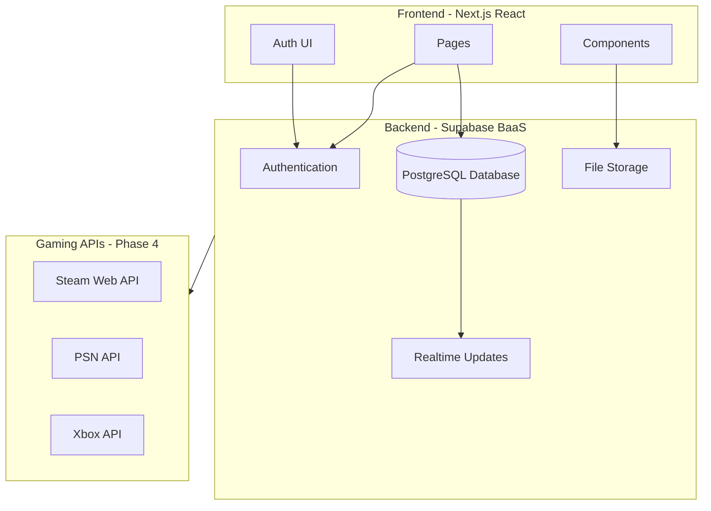

Perfect — beginner + web + learning project. That helps a lot. Here's my recommended approach:



Here is the full plan, broken into learnable phases:

---

**Recommended Stack: Next.js + Supabase**

**Why this stack for a beginner learning project:**

- **Next.js (React)** — The most popular React framework. Huge community, endless tutorials, and it handles both the frontend pages and backend API routes in one project. You'll learn React (the most in-demand frontend skill) while building.
- **Supabase** — A free, open-source backend-as-a-service built on PostgreSQL. It gives you a database, user authentication, file storage (for photos), and real-time features out of the box — no need to build a backend from scratch. Free tier is generous enough for learning.
- **TypeScript** — Optional but recommended. You can start with plain JavaScript and add types gradually.
- **Tailwind CSS** — Utility-first CSS framework that makes styling fast without needing deep CSS knowledge.

---

### Phase 1 — Project Setup and Authentication (Week 1-2)

1. Initialize a Next.js project in the `TrophyHunter` workspace with Tailwind CSS
2. Create a free Supabase project at [supabase.com](https://supabase.com)
3. Set up Supabase Auth (email/password sign-up, login, logout)
4. Build basic pages: Landing, Sign Up, Login, Dashboard
5. Create the database schema for user profiles

**Files created:**
- `package.json` — dependencies (next, react, @supabase/supabase-js, tailwindcss)
- `src/app/page.tsx` — Landing page
- `src/app/login/page.tsx` — Login page
- `src/app/signup/page.tsx` — Sign up page
- `src/app/dashboard/page.tsx` — User dashboard (protected)
- `src/lib/supabase.ts` — Supabase client configuration
- `src/components/AuthForm.tsx` — Reusable auth form

**Database tables (created in Supabase dashboard):**
- `profiles` — user_id, username, display_name, avatar_url, bio, created_at

---

### Phase 2 — Photo Sharing (Week 3-4)

1. Build image upload using Supabase Storage (game screenshots, setup photos)
2. Create a post system — users can share photos with captions and tags
3. Build a feed page showing posts from all users
4. Add categories: "Game Screenshot", "Setup", "Studio", "Other"

**New database tables:**
- `posts` — id, user_id, image_url, caption, category, created_at
- `tags` — id, name
- `post_tags` — post_id, tag_id

**New files:**
- `src/app/feed/page.tsx` — Social feed
- `src/app/posts/new/page.tsx` — Create new post
- `src/components/PostCard.tsx` — Post display card
- `src/components/ImageUpload.tsx` — Photo upload component

---

### Phase 3 — Trophy Collections (Week 5-7)

1. Build a manual trophy/achievement entry system first (name, game, platform, icon, rarity)
2. Create trophy showcase pages per user
3. Add trophy statistics (total count, by platform, completion percentage)
4. Display trophies in a visually appealing grid/list

**New database tables:**
- `trophies` — id, user_id, name, game_name, platform, description, icon_url, rarity, earned_at
- `platforms` — id, name, icon_url (PlayStation, Steam, Xbox, etc.)

**New files:**
- `src/app/trophies/page.tsx` — Trophy collection view
- `src/app/trophies/add/page.tsx` — Add trophy manually
- `src/components/TrophyCard.tsx` — Trophy display component
- `src/components/TrophyStats.tsx` — Statistics dashboard

---

### Phase 4 — Social Features and API Integration (Week 8+)

1. Follow/unfollow users
2. Like and comment on posts
3. User profile pages with trophy showcase + photo gallery
4. **Steam API integration** (easiest to start — free public API key at [steamcommunity.com/dev](https://steamcommunity.com/dev))
5. Research PSN and Xbox APIs (these are trickier — may need third-party services)

**New database tables:**
- `follows` — follower_id, following_id
- `likes` — user_id, post_id
- `comments` — id, user_id, post_id, content, created_at

---

### Project Structure Overview

```
TrophyHunter/
  src/
    app/                  # Next.js App Router pages
      page.tsx            # Landing page
      login/page.tsx
      signup/page.tsx
      dashboard/page.tsx
      feed/page.tsx
      posts/new/page.tsx
      trophies/page.tsx
      trophies/add/page.tsx
      profile/[username]/page.tsx
    components/           # Reusable UI components
    lib/                  # Supabase client, utilities
  public/                 # Static assets (logos, icons)
  package.json
  tailwind.config.ts
  .env.local              # Supabase keys (never commit this)
```

---

### What You'll Learn Along the Way

- **Phase 1**: React fundamentals, routing, authentication, environment variables
- **Phase 2**: File uploads, database CRUD operations, component composition
- **Phase 3**: Data modeling, aggregations, dynamic UI
- **Phase 4**: REST API consumption, social graph patterns, real-time updates

---

Want me to start building Phase 1? I'll set up the Next.js project, configure Tailwind, create the Supabase client helper, and build the landing page with auth flow.